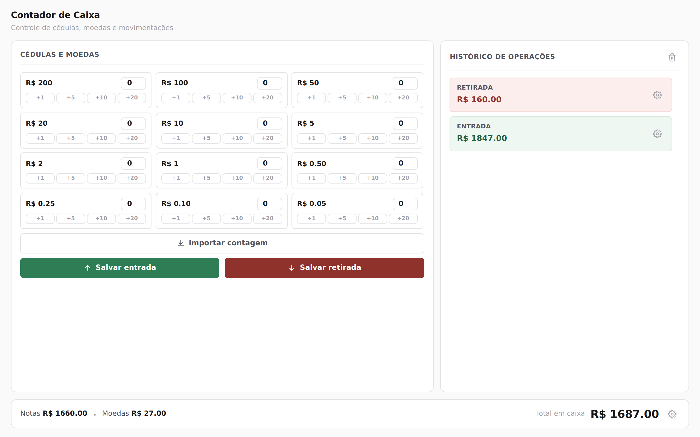

# Contador de Caixa

Ferramenta simples para conferência de caixa. Você conta as cédulas e moedas, registra se foi entrada ou retirada, e o sistema mantém o saldo e o histórico de tudo o que foi lançado.

Nasceu de uma necessidade prática: fechar caixa contando dinheiro físico, com histórico organizado, sem depender de planilha ou internet.



---

## Demonstração

Contando cédulas com os atalhos de quantidade, salvando uma entrada, depois uma retirada, e abrindo o detalhamento de uma operação no histórico:


Se preferir o vídeo em melhor qualidade, o arquivo está em [`media/demo.mp4`](media/demo.mp4).

---

## Como usar

Requer [Node.js](https://nodejs.org) 20 ou superior.

```bash
npm install
npm start
```

Depois acesse `http://localhost:3000`, crie sua conta e comece a lançar.

1. Entre com seu e-mail e senha (ou crie uma conta na própria tela de login).
2. Informe a quantidade de cada nota e moeda, digitando no campo ou usando os atalhos `+1` `+5` `+10` `+20`.
3. Clique em **Salvar entrada** (dinheiro entrando no caixa) ou **Salvar retirada** (dinheiro saindo).
4. O histórico, à direita, registra cada lançamento. Clique no ícone de engrenagem em qualquer item para ver o detalhamento por cédula e moeda.
5. Se precisar conferir rapidamente quanto tem no caixa agora, clique no ícone de engrenagem ao lado do total, no rodapé.
6. Já tem uma contagem pronta anotada em outro lugar? Cole em **Importar contagem**, uma linha por denominação, no formato abaixo.

```
3x R$ 50.00
10x R$ 5.00
25x R$ 0.25
```

### Saldo detalhado

Clicando na engrenagem ao lado do total geral, dá pra ver exatamente quantas cédulas e moedas de cada valor compõem o saldo atual:


### Recuperando um lançamento apagado

Apagar uma operação não a remove de verdade. Ela vai para uma lixeira, acessível pelo ícone ao lado de "Histórico de operações", de onde pode ser restaurada a qualquer momento:


---

## Por que foi feito assim

**Front-end sem framework, backend enxuto.** A interface continua sendo HTML, CSS e JavaScript puro. O servidor é um Express com SQLite: um único arquivo de banco, sem serviço externo para instalar ou manter. Para um caixa por usuário, isso é o suficiente.

**Cada usuário vê só o próprio caixa.** Todas as operações são gravadas com o `user_id` de quem as criou, e toda consulta filtra por ele.

**Sessão em cookie `httpOnly`.** O token é aleatório, o banco guarda apenas o hash dele, e o JavaScript da página nunca tem acesso ao valor. As senhas são armazenadas com `scrypt` e sal individual.

**O servidor valida tudo.** Denominações e quantidades são conferidas no back-end, independentemente do que o navegador enviar.

**Atalhos de quantidade em vez de só digitar.** Na correria de um caixa, clicar é mais rápido e menos sujeito a erro do que digitar número em teclado numérico de celular. Contar 20 notas de R$10 é dois cliques em "+10", não quatro toques pra digitar "20".

**Importação por texto como atalho, não substituto.** Se a contagem já está anotada em algum lugar, colar um texto no formato `3x R$ 50.00` é mais rápido do que preencher tudo de novo. Denominações que não existem (ex.: `R$ 3.00`) são ignoradas.

**Apagar não apaga de verdade.** A operação apagada recebe uma marca de exclusão no banco e vai para uma lixeira, de onde pode ser recuperada, exatamente como a lixeira do sistema operacional.

**Paleta quase toda em preto, branco e cinza.** Cor tem custo cognitivo: verde e vermelho aparecem só onde têm significado real (entrada e saída de dinheiro).

---

## Estrutura do projeto

```
contador-de-caixa/
├── public/                  → front-end
│   ├── index.html           → tela do caixa
│   ├── login.html           → tela de login e cadastro
│   ├── style.css            → aparência
│   ├── script.js            → lógica da tela do caixa
│   ├── login.js             → lógica da tela de login
│   └── api.js               → cliente da API
├── server/                  → back-end
│   ├── index.js             → inicialização
│   ├── app.js               → montagem do Express
│   ├── config.js            → variáveis de ambiente
│   ├── db.js                → conexão e esquema do SQLite
│   ├── session.js           → criação e leitura de sessões
│   ├── middleware.js        → autenticação e tratamento de erros
│   ├── passwords.js         → hash e verificação de senha
│   ├── denominations.js     → validação das cédulas e moedas
│   ├── repositories/        → acesso ao banco (users, sessions, operations)
│   └── routes/              → rotas (auth, operations, pages)
└── media/                   → screenshots e vídeo de demonstração
```

## Configuração

Todas as variáveis são opcionais.

| Variável      | Padrão            | Descrição                                                     |
| ------------- | ----------------- | ------------------------------------------------------------- |
| `PORT`        | `3000`            | Porta do servidor                                             |
| `DB_PATH`     | `data/caixa.db`   | Caminho do arquivo SQLite                                     |
| `NODE_ENV`    | —                 | Com `production`, o cookie de sessão passa a exigir HTTPS     |
| `TRUST_PROXY` | —                 | Use `1` se estiver atrás de proxy reverso (Nginx, Render etc.) |

O banco é criado automaticamente na primeira execução. Para fazer backup, basta copiar o arquivo `data/caixa.db`.

## API

| Método   | Rota                            | Descrição                          |
| -------- | ------------------------------- | ---------------------------------- |
| `POST`   | `/api/auth/register`            | Cria a conta e inicia a sessão     |
| `POST`   | `/api/auth/login`               | Inicia a sessão                    |
| `POST`   | `/api/auth/logout`              | Encerra a sessão                   |
| `GET`    | `/api/auth/me`                  | Usuário logado                     |
| `GET`    | `/api/operations`               | Lista as operações (inclui apagadas) |
| `POST`   | `/api/operations`               | Registra entrada ou retirada       |
| `DELETE` | `/api/operations/:id`           | Move a operação para a lixeira     |
| `POST`   | `/api/operations/:id/restore`   | Recupera a operação da lixeira     |

## Limitações conhecidas

- **Sem recuperação de senha.** Não há envio de e-mail; quem esquecer a senha precisa de um novo cadastro.
- **A importação de texto segue um formato fixo** (`Nx R$ valor`, uma denominação por linha). Textos em outros formatos não são reconhecidos.
- **O histórico é uma lista única**, sem separação por dia.

## Próximos passos, se for evoluir

- Exportar o histórico do dia em CSV ou PDF, para juntar ao fechamento de caixa.
- Filtro de histórico por data.
- Recuperação de senha por e-mail.
